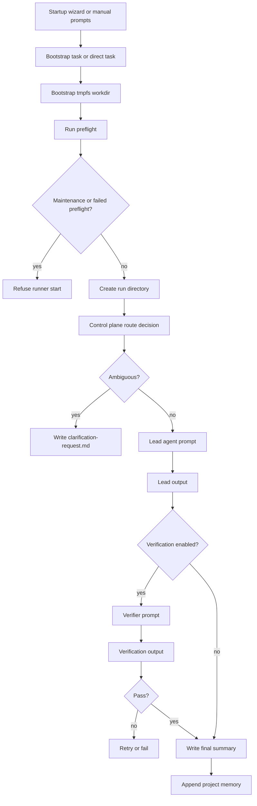

# Architecture

PromptClaw v2.1 is organized around one principle:

> the orchestrator is the control plane, and files are the transport layer.

## Components

### 1. CLI

`promptclaw.cli` exposes the operational commands:

- `init`
- `wizard`
- `doctor`
- `bootstrap`
- `run`
- `resume`
- `status`
- `show-config`
- `pal`

### 2. Startup wizard

The startup wizard is a requirement-capture layer that sits before bootstrap.

It:

- asks questions one at a time
- uses heuristics to ask follow-up questions when needed
- writes the starter prompts
- writes a startup profile and transcript
- updates project config and agent instructions

### 3. Project config

Each PromptClaw project has a `promptclaw.json` file that defines:

- project metadata
- control plane mode
- routing and retry policy
- artifact locations
- configured agents and their capabilities
- prompt file locations

`promptclaw.models` is the shared dataclass layer for those config, routing,
agent-result, event, and run-state contracts. It also exposes JSON-safe
diagnostic summaries for configs, agents, route decisions, and run states, so
operator/status surfaces can report model state without reinterpreting raw
dataclass fields differently in each caller.

### 4. Control plane

The control plane decides:

- whether the task is ambiguous
- which agent should lead
- which agent should verify
- what short handoff brief should be passed
- whether the run can complete or needs another loop
- when a live provider should be deprioritized or excluded because quota headroom is degraded

In SDP-backed queues, verification is task-scoped even when the project worktree
already contains unrelated local changes. Agents must commit their own task
changes, but pre-existing unrelated dirty or untracked files are treated as a
baseline condition and must not be cleaned, reverted, or folded into the task.

There are two modes:

- `agent`: ask a configured agent to return routing JSON
- `heuristic`: use built-in keyword + capability scoring

### 5. Artifact manager

Each run gets a directory:

```text
.promptclaw/runs/<run-id>/
├── input/
├── routing/
├── prompts/
├── outputs/
├── handoffs/
├── summary/
├── logs/
└── state.json
```

### 6. Agent runtime

Agent runtimes support three modes:

- `mock`
- `echo`
- `command`

`command` is the live mode. It writes a prompt file, executes the configured local command from the project root, and renders `{prompt_file}` and `{project_root}` as absolute paths so relative `PROJECT_ROOT` invocations still work.

In CypherClaw-style live command deployments, command routing can consult `sdp-cli` quota telemetry. Healthy and warn providers remain eligible, degraded and paused providers are excluded from new work, and if every provider is degraded the runtime falls back to the provider with the most remaining headroom instead of refusing to operate.

The live daemon also supports a hard local-only guard through `LOCAL_ONLY=true`. In that mode, the available-agent set collapses to `ollama`, the daemon skips cloud router CLIs entirely, and any explicit `claude`/`codex`/`gemini` step is coerced to `ollama` at execution time so fitness scores or routed step payloads cannot reintroduce cloud agent calls.

### 7. PAL platform

The PAL platform is PromptClaw's bounded reasoning and operations-assist layer.
It combines a configured PAL router, a local file-first knowledge base,
read-only diagnostic tools, and approval-gated action ids. PAL can plan,
summarize, and propose known actions, but PromptClaw keeps execution authority
in local allow-listed code and records every workflow in the standard run
artifact tree.

The PAL 2026 agent runtime starts as a configured router under the `pal`
section of `promptclaw.json`. The router commands can check health, run direct
queries, run the fixed smoke suite, and summarize saved smoke baselines.

The local PAL knowledge-base path is file-first. Source discovery reads
`pal.knowledge_sources`, chunking creates deterministic `pal-kb:` chunk ids, and
`promptclaw pal kb build` materializes those chunks into
`.promptclaw/pal-kb/index.jsonl` without contacting the router. `promptclaw pal
kb query` reads that local JSONL index, ranks lexical matches deterministically,
and returns bounded snippets with source paths and line ranges. PAL workflow
prompt artifacts now consume the same local index through a bounded `Knowledge
Context` section, so plans and summaries can cite local runbook/deployment
snippets without giving PAL any new execution authority. If the index is absent
or unreadable, workflows still run and record that local context was unavailable.

The first agentic PAL workflow is `promptclaw pal agent triage`. In that mode,
PAL is the reasoning agent but not the executor. PAL receives the operator task
and the diagnostic tool descriptions, returns a JSON tool plan, and PromptClaw
executes only allow-listed local tools. The diagnostic allow-list is
intentionally read-only:

- `pal_health`: call the configured router `/health` endpoint
- `pal_smoke_baseline`: summarize saved PAL smoke reports
- `tailscale_status`: run a fixed local Tailscale status check
- `ssh_process_check`: run a fixed read-only remote process/log check only when
  `PAL_SSH_HOST`, `PAL_SSH_PORT`, and `PAL_SSH_KEY` are set

`promptclaw pal agent actions` is the approval-gated action layer. It gathers
diagnostic context, asks PAL to propose action ids from a second fixed
allow-list, and executes nothing unless the operator passes `--approve
ACTION_ID`. The current action allow-list covers `rerun_smoke`,
`inspect_logs_deep`, `restart_router`, `pause_shutdown_once`, and
`resume_shutdown`. Unknown proposed actions and unknown approvals are ignored
and recorded. Restarts, shutdown overrides, and other mutating playbooks remain
human-approved action ids, not open-ended shell authority.

The Vast connector is currently a non-executing stub boundary. Its default
metadata marks `rent`, `destroy`, `start`, and `stop` as blocked lifecycle
operations and exposes `callable_actions=[]`; those ids are not registered PAL
actions and are ignored if PAL proposes them.

The slow-inference context workflow is a read-only PAL workflow primitive for
latency investigations. It is callable from code as
`run_pal_slow_inference_context(...)` and writes
`outputs/slow-inference-context.json` with router health, saved smoke baseline
token/s, optional GPU hints, and optional router/Ollama log tails. GPU and log
collection use fixed SSH diagnostics and report `skipped` when PAL SSH
environment variables are absent.

The operator-facing slow-inference diagnosis command is
`promptclaw pal diagnose slow-inference PROJECT_ROOT`. It reuses those same
fixed read-only collectors, writes `outputs/slow-inference-diagnosis.json`, and
derives deterministic findings for low baseline token/s, log-observed throughput
regression, non-green router health, missing evidence, and GPU saturation. The
route and diagnosis artifacts record `mutating_actions: []`; the command has no
approval surface and does not restart services, change config, alter cloud
rentals, or write remote files.

The restart-validation workflow is exposed as
`promptclaw pal validate restart PROJECT_ROOT`. It is also deterministic and
local-authority only: PromptClaw calls router health, sends one fixed direct
query, runs and saves the PAL smoke suite, checks local Tailscale status, and
runs the fixed read-only SSH process check when configured. The workflow writes
`outputs/restart-validation.json` with `workflow_id: restart_validation`,
`validation_status`, all observations, and `mutating_actions: []`; it validates
post-restart state but does not perform the restart itself.

The shutdown-audit workflow is exposed as
`promptclaw pal audit shutdown PROJECT_ROOT`. It stays inside the same
read-only local authority boundary: PromptClaw runs one fixed SSH diagnostic to
read shutdown config, cron registration, override flag state, current local
shutdown time, and recent shutdown logs, then derives the enabled state,
override state, and next five-minute shutdown window locally. The workflow
writes `outputs/shutdown-audit.json` with `workflow_id: shutdown_audit`,
`audit_status`, all observations, and `mutating_actions: []`; it audits shutdown
state but does not create or remove overrides, edit cron, or power down the
host.

The Phase 2 readiness workflow is exposed as
`promptclaw pal report phase2-readiness PROJECT_ROOT`. It scores fixed
prerequisites for operator authorization, Phase 1 health baselines, shutdown
safety, deployment reproducibility, the Vast cost boundary, and the no-execution
boundary. The workflow writes `outputs/phase2-readiness.json` with
`workflow_id: phase2_readiness_report`, per-prerequisite scores,
`overall_score`, `readiness_status`, all observations, `mutating_actions: []`,
and `phase2_execution_actions: []`. It is a report only: it does not rent,
start, stop, destroy, or resize instances, load Phase 2 models, migrate volumes,
restart services, or expose approval action ids.

PAL deployment tooling starts with a repo-managed manifest, not remote write
authority. `pal-2026/ops/deployment-manifest.json` is loaded through
`promptclaw.pal_deploy` and lists the intended `/opt/pal` managed files for the
host-managed Phase 1 runtime: startup scripts, router app, shutdown config,
deployment-info template, and Docker fallback files. Runtime state such as logs,
Ollama model storage, and the shutdown override flag is recorded as excluded
metadata rather than as files to sync, and the manifest validator rejects
targets outside `/opt/pal`, duplicate targets, malformed modes, missing required
sources, and secret-looking content. This is dry local metadata only; deploy
diff, plan, apply, backup, and rollback remain future approval-gated work.

Every PAL agent run uses the standard `.promptclaw/runs/<run-id>/` layout so the
plan, observations, approvals, results, summary, events, and state remain
reproducible.

### 8. CypherClaw resilience layer

CypherClaw live deployments add a runtime safety layer around the orchestrator:

- disk authority for `.sdp/state.db` and `.promptclaw/observatory.db`
- tmpfs workdir bootstrap via `my-claw/tools/init_workdir.sh`
- startup preflight via `my-claw/tools/preflight.py`
- unified health entry via `promptclaw doctor`
- explicit maintenance state via `my-claw/tools/maintenance_mode.py`
- checkpoint export via `my-claw/tools/runtime_checkpoint.py`
- systemd-managed runner startup through `my-claw/tools/sdp_runner_launcher.sh`

Identity bootstrap is part of startup hardening. Daemon poll loops call
`bootstrap_identity()` before creating `FirstBootAnnouncer`, and ASGI imports of
`cypherclaw.narrative_api.main:app` also bootstrap identity before app creation
so both standalone and federated homes persist identity on first boot.

The tmpfs workdir is acceleration only. It clones the repository into `/run/cypherclaw-tmp/workdir/<name>` and then symlinks the authoritative DBs back to disk so reboot or tmpfs loss cannot silently rewrite queue authority.

When the project root also looks like a live CypherClaw runtime, `promptclaw doctor` now includes the runtime preflight lane in addition to config validation. Plain starter projects still get the lighter config-only doctor path.

The live daemon path is now also portable across the MacBook dev home and the Linux server home. Status checks branch on platform, optional watchdog integrations are treated as optional imports, and runtime semaphore acquire/release/reject transitions are recorded so concurrency throttling is observable instead of implicit.

Maintenance mode is now disk-authoritative too. The canonical flag lives at `.sdp/MAINTENANCE`, resolved through the authority `state.db` path so tmpfs workdir copies cannot invent a second maintenance state. Entering maintenance while the managed runner or a running task exists now requires an explicit operator override; `safe_reboot.sh prepare` is the intended path for that transition.

Daemon child processes also run with a sanitized environment: `NOTIFY_SOCKET`, `WATCHDOG_PID`, and `WATCHDOG_USEC` are stripped before spawning agent CLIs or helper commands, so only the daemon main process talks to systemd's watchdog socket.

The managed runner path also repairs a stale `.sdp/run.lock` before preflight runs. That keeps normal systemd restarts from failing their own startup checks after the previous runner PID has been terminated.
The systemd runner unit itself now uses `Restart=always` so a clean `sdp-cli run` exit cannot silently strand the queue. Maintenance-gated launcher exits stay non-looping through `SuccessExitStatus=75` and `RestartPreventExitStatus=75`.
When a sibling `sdp-cli/src` checkout exists next to the home, the launcher also exports that path into `PYTHONPATH` automatically unless the operator has already pinned a different value. That keeps the live runner on the checked-out source tree instead of an older installed package.

Operator-facing Telegram status now also splits cleanly between built-ins and routed work. Queue-backed commands like `/monitor`, `/quota`, `/prd`, and `/tasks` read live runtime state directly instead of relying on conversational summaries, so queue progress, roadmap status, provider health, and actionable worklists stay aligned with the SQLite authority DB. Queue totals use one canonical denominator everywhere: all live executable tasks, excluding only split parents. `/prd` now also distinguishes empty roadmap stages from frozen or decomposed ones: stages with only frozen work are shown as `frozen`, stages with only split parents are shown as `decomposed`, and only truly absent work is shown as `not loaded`. `/monitor` now carries a compact `sdp-cli`-style status slice too: completion-gate status, latest completed run verdict/pair, and per-agent quota/provider health, while still surfacing queue-state drift when the active-task and open-task-run records disagree. `/tasks` now defaults to an operator-first queue view with running work, next root tasks, split-needed work, and attention items, while filtered slices like `/tasks frozen` or `/tasks all 20` expose deeper backlog details on demand. Roadmap-aware task slices such as `/tasks prd 6` and `/tasks stage clone and home creation` resolve through the same roadmap/batch files as `/prd`, so stage-level work inspection stays aligned with the live execution spine.

The live daemon scheduler also owns a compact half-hour heartbeat. At `:00` and `:30` each hour it sends uptime, I/O wait, memory, load, available-agent count, queue progress, and pet XP summary to Telegram, and records the send in Observatory. This is the text-only precursor to the richer GlyphWeave art heartbeat.
CypherClaw's tracker orchestration now also has an explicit instrument-patch layer. Cast voices are no longer used as a flat pool during normal listening: songs resolve into named house patches such as `house_monastery`, `house_chamber`, `house_garden`, `house_procession`, and `house_workshop`, with normal occupied listening biased toward `bowed`, `pluck`, `choir`, and `breath`. Those house patches are now musical as well as timbral: each patch carries its own contour bias, bass/comping vocabulary, dynamic envelope, and wider register spread. The older `bell` and `metal` voices are retired from live playback and degraded to tuned substitutes at runtime.
That patch layer now reaches all the way through tracker runtime and playback too: patch metadata survives family shaping and cadence clamping, live tracker scenes apply per-patch octave floors and ceilings by role, tracker forms vary by song number instead of always using one fixed five-scene length, and very high notes are softened with a small saturation-style shaping pass because the live synth surface does not expose a dedicated drive control.
Family planning is now more authored as well. `resolve_tracker_plan()` no longer pins large parts of the day to one family like `bloom`; it rotates through day-phase and weekly-phase family palettes, while also emitting a harmonic progression profile such as `awakening`, `open_day`, `lift`, `settling`, or `experiment` so the score generator changes not just scene shape but harmonic material across the day.

`my-claw/tools/telegram.py` now treats test execution and tmpfs task-run workdirs as non-production contexts by default. If `PYTEST_CURRENT_TEST` or `PROMPTCLAW_TEST_MODE` is present, or if the helper is running from `/run/cypherclaw-tmp/workdir/`, Telegram sends are suppressed unless `PROMPTCLAW_ALLOW_LIVE_TELEGRAM=1` is set explicitly. That keeps shell-script, subprocess, and copied-workdir tests from leaking alerts into the live operator chat.

The live CypherClaw solo music scheduler is also now tracker-first: it selects an active character cast, maps those character roles into tracker lane voice hints, and applies scene-level role floors so subdued moods still keep a cast-grounded foundation lane through `Theme`, `Development`, and `Recap`.
That tracker path is now also mode-aware. Harmonic authority flows through the keyboard grimoire and the new harmonic planner: fresh keyboard, inner-life, and garden hints are normalized into a canonical key spec, scene-level modulation is planned before tracker scheduling, and stale outdoor or MIDI state is ignored instead of pinning the whole piece to an old major root.
Melodic authority is now song-aware too. `score_from_mood()` seeds a motif-driven generator with song number, tracker family, cadence state, and recent melodic-memory fragments so repeated moods can still yield different note cells, rhythm cells, leap profiles, and occasional recalled motifs instead of recycling one default contour under new keys. The same generator now rotates comping styles as well, so the foundation line does not keep repeating one root-walk pattern.
That motif system now has family memory instead of only recency memory. The live learner tags each tracker song with family, progression profile, cadence state, and house patch, recent in-session fragments can be recalled by matching those tags, and persisted melodic memory can rank stored fragments by the same keywords so re-entering `ember` or `drift` can produce an answer or recall gesture from earlier related songs instead of sounding fully disconnected.
That recall now also happens inside a single tracker song. Once `Theme` exists, later scenes such as `Recap` and short-form `Release` can explicitly borrow lane-level motif shapes from it, rescale them to the new scene length, and resolve them with a small answering transform. That gives the form an actual memory curve instead of making every scene a fresh quantization of the same phrase-level score.
The next musicianship layer is now live as a real end-to-end stack rather than only a roadmap. M1 adds a reharmonization layer through `reharmonizer.py` and `harmonic_planner.py`, so tracker songs carry section functions, cadence types, and a named reharm strategy. M2 adds a hook engine through `hook_engine.py`, which now emits deterministic song-title, hook-text, hook-type, and phrase-pair material that survives into score metadata. M3 adds `arrangement_engine.py`, which turns tracker forms into section-level groove and automation plans instead of treating every scene as a raw template replay. M4 adds `ear_engine.py` plus deliberate `practice_curriculum.py` blocks, so performed notes are analyzed for interval variety, hook clarity, leap ratio, register spread, and cadence strength while away-mode songs can focus on Harmony, Melody, Arrangement, Ear, or Scene labs. M5 adds `prosody_engine.py`, which gives tracker songs short titles and scene captions that the face layer can surface. M6 adds `repertoire_memory.py`, a long-term song memory that stores titles, hook text, cadence/family context, and ear metrics so CypherClaw can gradually accumulate a repertoire instead of living only in fragment memory.
That M1-M6 layer is now threaded through the live tracker path. `duet_composer.py` selects a practice block, resolves harmonic section metadata, writes title/hook/prosody state into `/tmp/composer_state.json`, stores completed songs into repertoire memory, and lets the face surface a song title and scene caption instead of only key and movement changes. The result is a more authored pipeline: function and cadence inform the form, the score now has a named hook, the tracker carries section intent, the learner judges the result, and the piece can remember whole songs as well as motifs.
The next songwriting layer is now active above that tracker runtime too. CypherClaw no longer has to treat the tracker as the composer: `piece_commission.py` chooses a form class, composition mode, duration target, groove identity, and ending family; `piece_brief.py` turns world/narrative state into a concrete brief; `form_grammar.py` expands that into section functions with duration budgets; `recursive_composer.py` turns the brief plus hook profile into a full `ScoreTree`; `composition_gate.py` rejects underbuilt sketches; and `tracker_compiler.py` compiles approved trees into tracker scenes only after the whole-piece architecture exists. `piece_queue.py` keeps a small queue of precomposed score trees at `/home/user/cypherclaw-data/state/piece_queue.json`, so the live runtime can keep one committed piece active while preparing the next one in the background instead of improvising every song from scratch. `repertoire_memory.py` now stores a `score_tree_summary` alongside the old surface metadata, which means repertoire can remember section functions, motif ids, narrative beats, and ending family rather than only titles and hook text. The live commission layer now also carries an audibility bias: the very first post-boot piece is capped away from maximal suite scale unless the cadence is already in sleep or wind-down territory, so runtime recovery produces a committed audible piece instead of immediately disappearing into a sparse ten-minute introduction. And long section budgets now expand mostly through repeated phrase cycles rather than by stretching every note into a drone, which keeps long-form pieces song-like when they are compiled down into tracker rows. That compiler layer is now section-aware too: each scene gets its own derived score, section-function transforms, and motif-aware rewrites before quantization, so `Theme`, `Development`, `Recap`, and `Afterglow` no longer share one base phrase body with only density changes on top. Longer scenes now also carry coordinated internal phrase families such as `A`, `A_prime`, and `B` inside the same section body, with tracker-step root/function provenance, so a development section can unfold recursively while melody, bass, counter, and color lanes follow the same harmonic turns before any repeat-cycle variation is applied. Scene endings are now transition-aware as well: non-final sections know the next section's target function and root, and the tracker reshapes only the final repeat cycle's tail events into preparation tones so section boundaries behave like composed handoffs rather than hard resets.
The tracker quantizer also now has a simple arrangement timeline inside repeated scenes. It computes per-role `entry_cycle` / `exit_cycle` windows, so support lanes can arrive after the foundation and melody in `Development`, `Bridge`, or `Lift` sections. This is deliberately separate from note variation: the same phrase family can exist, but the ensemble density changes over time.
The motif-recall layer now respects the same transition authority. Recalled lanes remove transition fields from their source scene and reattach the current scene's target root/function to the final tail, so return sections can sound like returns without pointing their cadence back at the wrong section.
The compiler now adds a section-local motif/progression layer above those tracker mechanics. `tracker_compiler.py` derives a named motif-development mode from each section function, rewrites melody/counter material accordingly, chooses a local four-step harmonic progression from the section's harmonic role/function, and reshapes bass/counter/color/melody notes against that progression. The tracker then preserves `motif_development`, `section_progression`, and per-step progression roots/roles, which makes a long piece more like related thematic development than one motif poured through unrelated scene templates.
The same compiler layer now owns section rhythm identity. `tracker_compiler.py` maps section functions onto named rhythm-development modes and duration cells, then rewrites phrase durations and accents before internal phrase-family expansion. That means `Development` can be recognizably syncopated, `Bridge` can feel displaced or half-time, `Arrival` can drive, and `Afterglow` can breathe out while all of those choices remain inspectable through tracker metadata.
The motif-recall layer preserves this current-section rhythm identity too. Recalled steps strip stale source section rhythm/progression fields before receiving the current scene's `rhythm_development`, `rhythm_cell`, and progression metadata, keeping diagnostics and downstream listeners aligned with the section currently being performed.
The tracker now turns that section identity into audible arrangement curves. `music_tracker.py` maps `rhythm_development` into an `arrangement_curve`, writes multi-point automation lanes for `density`, `master_amp`, and `reverb_send`, and shapes each lane's note velocity across its own active window without raising the register. `music_tracker_runtime.py` publishes interpolated row automation in `/tmp/tracker_runtime_state.json`, uses low density to thin optional color/counter events while preserving bass and melody, and `duet_composer.py` periodically applies those current values to `sw_master_smooth`, so a long `Development` can actually rise, a `Bridge` can open into suspended reverb, and residues can fade instead of looping at one flat mix level.
The EMSD layer now exists as a parallel production-and-sound-design package rather than only a future brief. `my-claw/curriculum/` contains a full 40-course EMSD catalog plus scaffolded course directories, while the runtime gained `sound_palette_lab.py`, `sample_lab.py`, `mix_engine.py`, `procedural_arc.py`, `dsp_scene_lab.py`, `artistic_identity.py`, `capstone_engine.py`, and `emsd_runtime.py`. Together, those modules give CypherClaw a formal sound-design study surface: synthesis-method-aware palette studies, environmental sampling plans, cadence-aware mix targets, 30-minute arc directives, audio-to-visual feature mapping, capstone-cycle planning derived from repertoire identity, and one typed live context object that the composer can consume directly instead of reconstructing EMSD state ad hoc.
That EMSD layer is now live in the tracker path too. Before each tracker song is built, `duet_composer.py` constructs an EMSD context from cadence state, occupancy, family, patch, attention, CPU pressure, Theramini presence, and repertoire history. That context can now bias the active density shape, and its arc/mix/sample/DSP/identity fields are written into `/tmp/composer_state.json` at scene boundaries. `self_listener.py` also reads those fields back alongside `/tmp/cadence_state.json` and publishes `/tmp/glyph_audio_features.json`, so GlyphWeave-facing consumers can finally see brightness, motion, density, sample source, DSP blocks, and arc phase as a coherent audio-driven surface rather than inferring them from raw transport state. When direct self-capture hangs on the live JACK recorder path, that listener can now fall back to a fresh `/tmp/room_capture.wav` clip instead of dropping all the way to a dark `capture_timeout` state.
That EMSD context now reaches the note-render stage too. `emsd_performance.py` turns the live mix profile, sampling plan, and DSP scene into per-event amp/release/brightness/space/filter/drive adjustments, and `play_voice()` applies those adjustments on top of the existing per-register shaping. In practice this means `garden_mic` / `spectral_smear` scenes really render softer and bloomier, `theramini_in` / `parallel_delay` scenes really widen and duck frontline voices, and the top register is now folded harder: notes above roughly `C6` are pulled down an octave, and the sharpest top band is pulled down two octaves instead of only one.
The EMSD sampling side now has stable capture authority as well. `room_listener.py`, `contact_listener.py`, `theramini_listener.py`, and `self_listener.py` mirror their latest clips into `/tmp/room_capture.wav`, `/tmp/contact_capture.wav`, `/tmp/theramini_capture.wav`, and `/tmp/self_capture.wav` so higher-level planners can target durable sample paths instead of short-lived listener scratch files. `self_listener.py` also writes `/tmp/sample_dsp_activity.json` by combining those capture ages with composer, cadence, and sensor state. That file is the live sampler/DSP intent surface: it says which source is fresh, whether it should trigger now, which activity mode is appropriate (`texture_bed`, `slice_accents`, `window_echo`, `grain_cloud`, `freeze_bed`, `lowpass_wash`), and what wetness, grain density, stretch, filter, pitch window, and reverse probability should be used if a downstream sampler layer consumes it. If the requested source is unavailable, that planner can now fall back to a fresh room/contact/self capture instead of leaving the sampler stranded on a dead path like an absent `garden_capture.wav`.
That sampler layer is now live, not only planned. `sample_playback_engine.py` reads `/tmp/sample_dsp_activity.json`, renders short room-derived events through `sample_event_renderer.py`, and plays them back through PipeWire as a sparse auxiliary layer. It also publishes `/tmp/sample_playback_state.json`, which records whether the sampler is currently playing, which activity mode launched, which capture path was used, and where the rendered event file lives. On hosts where the 10TB archive volume is mounted, those rendered sample events now default to `/mnt/archive/cypherclaw/sample_events` instead of growing under `/tmp` or the root disk. Stable ambient scenes are allowed to refresh after cooldown even when their source signature is unchanged, so Divination and other bed-oriented states do not go silent after one render cycle.
On the current CypherClaw hardware, the default ambient study source is now the room/Perform-VE condenser path rather than `garden_mic`. Divination and Emergence scenes keep the soft spectral-smear / long-convolution language around `room_mic`, and Convergence/Crystallization now also bias back toward `room_mic` for lived-in states instead of defaulting to `self_bus`. The exception is `away_practice`, where the late arc can still use `self_bus` as an explicit internal remix source.
The room-listener path now also reports which backend actually won. `room_speech.json` can include `capture_backend` and `capture_source`, and the boot script no longer hard-forces `--no-jack`; it now tries a PipeWire `pw-record` target for Perform-VE first, then falls back to JACK, then ALSA if needed. That matters on the live box because PipeWire can see the Perform-VE device even when the old raw JACK/ALSA assumptions were wrong. When ALSA fallback is still required, the selector prefers the Perform-VE interface over generic analog or webcam capture, and the ALSA capture loop retries alternate sample formats per device before moving on. When the named Perform-VE JACK port is absent but real JACK capture ports are available, `room_listener.py` now tries direct `jack_rec` on fallback ports like `system:capture_1` before dropping to ALSA, which prevents `/tmp/room_capture.wav` from staying stale and forcing the sampler onto a quiet self-bus fallback.
The audio boot path itself is now more defensive too. `start_audio.sh` no longer disables synthdef auto-loading with `-D 0`; it links the repo SynthDef bundle into `~/.local/share/SuperCollider/synthdefs`, starts `scsynth` with auto-load enabled, and prefers a real JACK/Scarlett graph when one is available before falling back to PipeWire's JACK shim. That preference is now verified instead of assumed: the launcher only stays on real JACK when `system:playback_1` is visible, and if `scsynth` fails to register `SuperCollider:out_1` on that graph it kills the failed server and retries automatically on `pw-jack` instead of leaving CypherClaw silent. When it does need to rebuild real JACK, it now clears stale JACK state, relaunches `jackdbus`, and configures the ALSA backend for `hw:USB` before booting `scsynth`, which makes the Scarlett monitor path recoverable after a JACK/DBus drift. `restart_composer.sh` now treats audio as an existing dependency rather than trying to rebuild the whole synth library over OSC, waits for a healthy steady-state `duet_composer.py` process rather than only trusting the first short-lived child PID emitted during startup, and launches that composer through `nohup setsid ... </dev/null` so it survives operator session teardown. `self_listener.py` is now pinned to the verified JACK capture path on this host by the AV boot wrapper, still keeps explicit PipeWire and `pw-jack` fallbacks available in code, publishes `capture_backend` in `/tmp/self_listen.json`, and derives glyph-facing brightness/motion from the captured audio itself instead of from target-only centroid metadata.
That restart path now also reseeds the `sw_master_smooth` node twice on purpose: once while the outputs are muted and the old composer is down, and again after the new `duet_composer.py` process is confirmed alive. The second reseed matters because the composer clears the root group on startup before building the next piece, which would otherwise leave scene-level master-bus automation writing to a dead node and make the runtime effectively silent even while tracker events are still being scheduled.
Cold boot now has a repo-backed AV entrypoint too. `cypherclaw_av_boot.sh` waits for the display, checks whether `scsynth` and `duet_composer.py` are already present from another startup path, and only calls `start_audio.sh` / `restart_composer.sh` if they are still missing. After that it waits for `SuperCollider:out_1`, relaunches `self_listener.py` under a detached session with the explicit verified JACK backend, force-restarts `face_display.py` and `gallery_x11.py` under X, and exports `XDG_RUNTIME_DIR=/run/user/1000` for those display clients so they attach to the real user session instead of restarting into a blank SDL/X state. It only backfills `room_listener.py` and `sample_playback_engine.py` if no other startup path has already brought them up during the same boot. If stale copies from earlier bad boot loops are already present, that wrapper now deduplicates those optional daemons back down to one live process, then runs a second delayed dedupe pass so late-start copies from another boot hook are also collapsed. That wrapper now also normalizes the live dual-head modes after X recovery, using the observed `DP-2` face screen at `1280x1024` and `DP-0` gallery screen at `3840x2160`, and it launches the face on `:0.0` with the gallery on `:0.1` so the 4K gallery is no longer offset into the wrong coordinate space. `cypherclaw_boot.sh` now delegates core audio/composer/face/gallery/room-listener/sample ownership to that wrapper instead of trying to start the same daemons itself. The matching `cypherclaw-av-stack.service` is designed as a system service bound to `graphical.target`, so the live music/face stack can return after reboot even when only the core main daemon unit is already persistent.
The boot path now starts the Theramini and contact-mic listeners alongside the room and self buses, which means those stable EMSD capture aliases can actually refresh during unattended runtime instead of existing only as planned fields in `/tmp/composer_state.json`.
The face layer now reflects that sampler state as well. `face_display.py` reads `/tmp/sample_dsp_activity.json`, `/tmp/sample_playback_state.json`, and `/tmp/self_listen.json`, so the head monitor can distinguish between the sampler plan, the sampler that is actually playing, and a broken self-monitor path. In practice this means sparse late phases can say `playing room mic · freeze bed` when the layer is sounding, or surface monitor failure instead of blindly echoing a planned playback state.
The operator diagnostics path now reads those same authority files through `my-claw/tools/senseweave/operator_diagnostics.py` and renders them in daemon `/status`. That keeps status output aligned with the live score-tree, tracker, composer, sampler, master-bus, and self-listener contracts instead of showing only daemon counters. SenseWeave behavior gates live in `my-claw/tools/senseweave/rollout_controls.py` and are controlled by `CYPHERCLAW_ENABLE_CURRICULUM_EXERCISE`, `CYPHERCLAW_ENABLE_PREVIEW_RENDER`, `CYPHERCLAW_ENABLE_SELF_CRITIQUE`, and `CYPHERCLAW_ENABLE_LONG_FORM_SUITE`, so curriculum exercises, preview metrics, revision passes, and suite-scale commissioning can be rolled back independently.
The local camera path now assumes a single shared webcam unless another device is configured explicitly. `observer_vision.py` owns `/dev/video0` by default and only treats a frame as fresh when the underlying `ffmpeg` capture succeeds, so stale JPEGs no longer masquerade as live camera input after a device error. `room_presence_daemon.py` can run in `--observer-frame-only` mode, where it derives presence from the shared `/tmp/observer_frame.jpg` instead of contending for the same webcam. In that mode it mirrors the shared frame into `/tmp/room_frame.jpg`, so archive and downstream consumers still see a fresh room image instead of a frozen old capture.
Heavy long-lived artifacts now have an archive-root contract too. Runtime helpers prefer `CYPHERCLAW_ARCHIVE_ROOT` when set, otherwise they use `/mnt/archive/cypherclaw` on machines where the 10TB archive disk is mounted, then fall back to the older `/home/user/cypherclaw-data` layout or a project-local archive directory. That storage root now owns Litestream file replicas, archive-daemon outputs, rendered sample-event WAVs, and the porch/side camera capture rings, which keeps those high-growth paths off the NVMe root volume.
The slow observer summary path is now queue-aware as well. `observer_vision.py` now accepts an ordered `OBSERVER_OLLAMA_URLS` list and the boot path routes it to a dedicated observer queue on `127.0.0.1:11435` before falling back to the shared `11434` instance. A matching `cypherclaw-observer-ollama.service` runs that second queue as the `ollama` user against the shared model store, which keeps camera summaries from competing directly with the main local model traffic. When both endpoints are saturated, the observer no longer writes the raw `HTTP Error 503` text as the room description. Instead it publishes a compact local fallback summary derived from the fast image analysis, records `vision_backend` and `vision_error` in `/tmp/observer_state.json`, and backs off before retrying the slow multimodal call again. That keeps the observer state readable during local-model contention while still leaving the slow summary path available when Ollama is free.
The sampler plan itself is now scene-aware and transport-aware too. `sample_dsp_activity.py` no longer chooses only a generic mode from transforms and DSP blocks; it also reads the 30-minute arc phase plus tracker scene and row state from the self-listener, then emits a scene profile such as `development_grains`, `theme_accents`, `recap_echo`, `divination_bed`, or `afterglow_residue` together with a transport trigger key. `sample_event_renderer.py` consumes that profile to change grain count, event duration, bed spacing, echo spacing, peak target, filter ceiling, and stretch, and `sample_playback_engine.py` now uses the transport key to launch once per musical bucket instead of free-running only on cooldown. The practical effect is that `Development` room material can widen into denser grain clouds while `Afterglow` and `Resolution` can leave a longer, softer residue instead of sharing the same generic freeze or slice pattern.
EMSD mix state now reaches the real master bus too. Tracker scene starts no longer only update per-note render shaping; they also translate `mix_target_lufs`, `mix_bus_comp_ratio`, `mix_peak_ceiling_dbtp`, scene `master_amp`, and scene `reverb_send` into live `sw_master_smooth` control updates, so scene density and mix intent affect the actual summed output path.
That repertoire layer is no longer passive. Before each tracker song is built, the live composer now asks `repertoire_memory.py` for an influence object keyed by family and cadence state. That influence can bias the next song's progression profile as well as title and hook generation, and it can now also recommend a tracker form variant, a section-density bias, and a preferred payoff scene. Strong earlier songs can therefore echo forward not only as language and harmony, but also as structural memory that nudges the next song toward bridge, concise, or afterglow forms with a matching density contour and a remembered place of arrival. The hook path now also uses phrase-level answer transforms instead of a blunt suffix fallback, and those transforms are context-aware rather than single-template replacements: the same recalled hook can answer differently across family, cadence, and song context while staying grammatical. The hook generator now normalizes a small set of historically awkward phrases too, so rough forms like `carry the line wide` or `open the room open` collapse back into musically usable hooks before they can propagate through repertoire recall. Title generation is now tied to the same image field as the hook at the phrase level, not just the noun level, and that title planner now also reacts to cadence state, progression profile, and hook type. The result is that calmer hooks can land in phrases like `Low Light` or `Quiet Rooms`, while brighter or more kinetic hooks can move toward `Electric Circuits`, `Moving Lines`, or `Open Thresholds` instead of repeating one adjective-noun template. The same planner also avoids exact title repeats from remembered repertoire hints, so callback titles can echo earlier songs without cloning them verbatim. The prosody layer now reshapes that same hook by section too, so `Theme`, `Recap`, `Release`, `Resolution`, and `Afterglow` can carry the same motif with different textual density instead of reusing one caption verbatim across the whole song. That caption shaping is now harmonic-function-aware as well: the same `Afterglow` hook can read differently under `half`, `plagal`, `authentic`, or `deceptive` cadences, which lets the face text follow the actual harmonic landing rather than only the scene name. It is now orchestration-aware too: sparse `house_monastery` or `house_chamber` scenes can compress a hook into a leaner noun phrase, while denser `house_workshop` or `house_procession` scenes can widen the same hook into a fuller line, which lets the face react to texture before the harmony resolves. `repertoire_memory.py` also repairs legacy broken hook text on load and on write, so older bad phrases do not keep leaking forward into new songs after the hook system improves.

High-note playback shaping is also more explicit now. `voice_shaping.py` still softens the top octave with lower gain, shorter releases, less pluck brightness, and small detune/space offsets, but it now also carries best-effort `highpass_hz` and `saturation_mix` intents into `play_voice()`. The highest live octave is also folded down by one octave at playback time, so the ensemble can keep its bright gestures without parking the harshest voices in an ear-splitting register. When the underlying SynthDefs expose matching controls, very high notes can be filtered and driven slightly instead of only being attenuated.
The tracker orchestration path now also preserves a wider instrument palette, but with lane-aware and cadence-aware safety. Cast planning keeps at least one non-core support role on stage even during lower-energy songs, direct character synths can pass through the tracker runtime when they match the lane semantics, and quiet `wind_down` or sleep scenes automatically soften chirpy `pluck`/`kotekan`/`grain` choices toward bowed, breath, choir, or gong voices so the late-night organism does not sound like daytime birds. `sw_grain` is also quarantined at tracker runtime for now because the live SynthDef was leaking nodes and accumulating into broadband static overnight, and the runtime aliases `tabla_ge` to `tabla_tin` until a real `sw_tabla_ge` SynthDef exists in the deployed bundle. Primary tracker-role gains are now deliberately hotter too: bass, melody, and rhythm lanes carry a higher live floor than the earlier sketch-era defaults so a valid running piece cannot hide under the room noise floor merely because the new score-tree layer chose a restrained opening. That role floor is now balanced rather than just louder: bass no longer dominates by default, texture lanes carry a meaningful minimum presence, and EMSD note-level mix shaping no longer hard-clamps normal daytime bass/melody material at the top of its amp range.
For the same reason, runtime `gong` playback is now aliased to a tuned bowed voice on the live box; the old inharmonic gong body was too detached from the harmonic planner's western/modal pitch center.

### 9. Memory

Rolling memory lives in:

```text
.promptclaw/memory/project-memory.md
```

After a run finishes, the orchestrator appends:

- run id
- task summary
- selected agents
- verification result
- final resolution
- open issues

Future routing uses that memory to preserve continuity.

## Runtime sequence



## Why this layout exists

The core failure in a prompt-only multi-agent setup is that one agent cannot actually transfer execution to another by itself. PromptClaw solves that by introducing an explicit software control plane that:

- knows which agents exist
- knows how to invoke them
- knows how to parse their outputs
- keeps startup requirements in durable markdown artifacts

For CypherClaw live operations, that control plane now also sits inside an operational shell that must survive reboot and maintenance. The orchestrator is not considered safe to start until bootstrap, preflight, and maintenance-state checks all agree that the runtime is sane.
