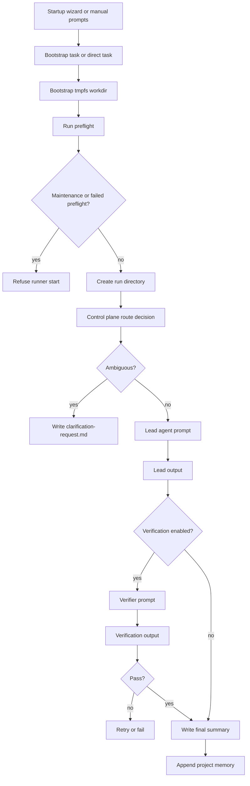

# Architecture

PromptClaw v2.1 is organized around one principle:

> the orchestrator is the control plane, and files are the transport layer.

## Components

### 1. CLI

`promptclaw.cli` exposes the operational commands:

- `init`
- `wizard`
- `doctor`
- `bootstrap`
- `run`
- `resume`
- `status`
- `show-config`

### 2. Startup wizard

The startup wizard is a requirement-capture layer that sits before bootstrap.

It:

- asks questions one at a time
- uses heuristics to ask follow-up questions when needed
- writes the starter prompts
- writes a startup profile and transcript
- updates project config and agent instructions

### 3. Project config

Each PromptClaw project has a `promptclaw.json` file that defines:

- project metadata
- control plane mode
- routing and retry policy
- artifact locations
- configured agents and their capabilities
- prompt file locations

### 4. Control plane

The control plane decides:

- whether the task is ambiguous
- which agent should lead
- which agent should verify
- what short handoff brief should be passed
- whether the run can complete or needs another loop
- when a live provider should be deprioritized or excluded because quota headroom is degraded

There are two modes:

- `agent`: ask a configured agent to return routing JSON
- `heuristic`: use built-in keyword + capability scoring

### 5. Artifact manager

Each run gets a directory:

```text
.promptclaw/runs/<run-id>/
├── input/
├── routing/
├── prompts/
├── outputs/
├── handoffs/
├── summary/
├── logs/
└── state.json
```

### 6. Agent runtime

Agent runtimes support three modes:

- `mock`
- `echo`
- `command`

`command` is the live mode. It writes a prompt file, executes the configured local command from the project root, and renders `{prompt_file}` and `{project_root}` as absolute paths so relative `PROJECT_ROOT` invocations still work.

In CypherClaw-style live command deployments, command routing can consult `sdp-cli` quota telemetry. Healthy and warn providers remain eligible, degraded and paused providers are excluded from new work, and if every provider is degraded the runtime falls back to the provider with the most remaining headroom instead of refusing to operate.

### 7. CypherClaw resilience layer

CypherClaw live deployments add a runtime safety layer around the orchestrator:

- disk authority for `.sdp/state.db` and `.promptclaw/observatory.db`
- tmpfs workdir bootstrap via `my-claw/tools/init_workdir.sh`
- startup preflight via `my-claw/tools/preflight.py`
- unified health entry via `promptclaw doctor`
- explicit maintenance state via `my-claw/tools/maintenance_mode.py`
- checkpoint export via `my-claw/tools/runtime_checkpoint.py`
- systemd-managed runner startup through `my-claw/tools/sdp_runner_launcher.sh`

The tmpfs workdir is acceleration only. It clones the repository into `/run/cypherclaw-tmp/workdir/<name>` and then symlinks the authoritative DBs back to disk so reboot or tmpfs loss cannot silently rewrite queue authority.

When the project root also looks like a live CypherClaw runtime, `promptclaw doctor` now includes the runtime preflight lane in addition to config validation. Plain starter projects still get the lighter config-only doctor path.

### 7. Memory

Rolling memory lives in:

```text
.promptclaw/memory/project-memory.md
```

After a run finishes, the orchestrator appends:

- run id
- task summary
- selected agents
- verification result
- final resolution
- open issues

Future routing uses that memory to preserve continuity.

## Runtime sequence



## Why this layout exists

The core failure in a prompt-only multi-agent setup is that one agent cannot actually transfer execution to another by itself. PromptClaw solves that by introducing an explicit software control plane that:

- knows which agents exist
- knows how to invoke them
- knows how to parse their outputs
- keeps startup requirements in durable markdown artifacts

For CypherClaw live operations, that control plane now also sits inside an operational shell that must survive reboot and maintenance. The orchestrator is not considered safe to start until bootstrap, preflight, and maintenance-state checks all agree that the runtime is sane.
