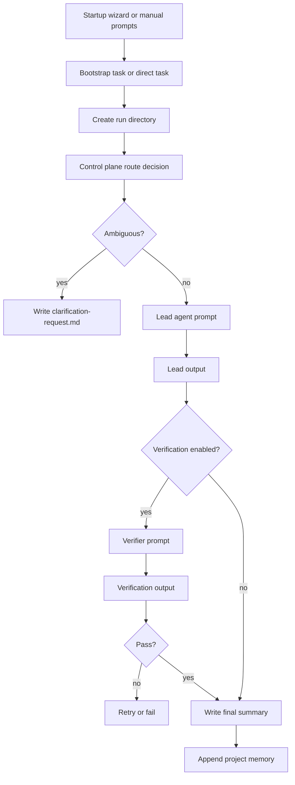

# Architecture

PromptClaw v2.1 is organized around one principle:

> the orchestrator is the control plane, and files are the transport layer.

## Components

### 1. CLI

`promptclaw.cli` exposes the operational commands:

- `init`
- `wizard`
- `doctor`
- `bootstrap`
- `run`
- `resume`
- `status`
- `show-config`

### 2. Startup wizard

The startup wizard is a requirement-capture layer that sits before bootstrap.

It:

- asks questions one at a time
- uses heuristics to ask follow-up questions when needed
- writes the starter prompts
- writes a startup profile and transcript
- updates project config and agent instructions

### 3. Project config

Each PromptClaw project has a `promptclaw.json` file that defines:

- project metadata
- control plane mode
- routing and retry policy
- artifact locations
- configured agents and their capabilities
- prompt file locations

### 4. Control plane

The control plane decides:

- whether the task is ambiguous
- which agent should lead
- which agent should verify
- what short handoff brief should be passed
- whether the run can complete or needs another loop

There are two modes:

- `agent`: ask a configured agent to return routing JSON
- `heuristic`: use built-in keyword + capability scoring

### 5. Artifact manager

Each run gets a directory:

```text
.promptclaw/runs/<run-id>/
├── input/
├── routing/
├── prompts/
├── outputs/
├── handoffs/
├── summary/
├── logs/
└── state.json
```

### 6. Agent runtime

Agent runtimes support three modes:

- `mock`
- `echo`
- `command`

`command` is the live mode. It writes a prompt file and then executes the configured local command.

### 7. Memory

Rolling memory lives in:

```text
.promptclaw/memory/project-memory.md
```

After a run finishes, the orchestrator appends:

- run id
- task summary
- selected agents
- verification result
- final resolution
- open issues

Future routing uses that memory to preserve continuity.

## Runtime sequence



## Why this layout exists

The core failure in a prompt-only multi-agent setup is that one agent cannot actually transfer execution to another by itself. PromptClaw solves that by introducing an explicit software control plane that:

- knows which agents exist
- knows how to invoke them
- knows how to parse their outputs
- keeps startup requirements in durable markdown artifacts
